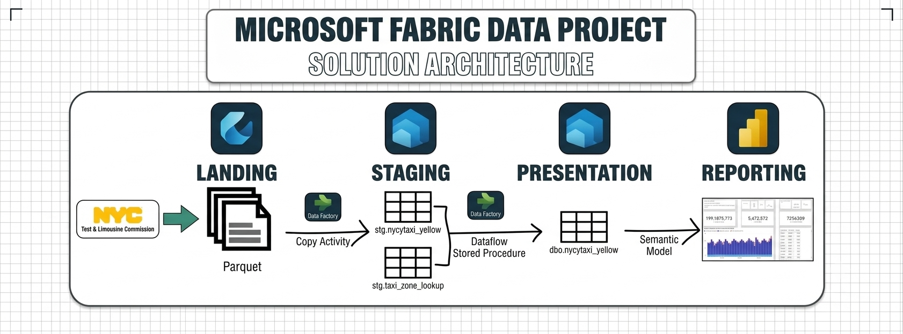

# 🚕 NYC Taxi End-to-End Data Engineering & Analytics Pipeline

An end-to-end data pipeline built on **Microsoft Fabric** that automates the ingestion, staging, transformation, and reporting of New York City Yellow Taxi trip records.

---

### NYC Taxi Solution Architecture

## 📌 Project Overview & Problem Statement

### **The Business Challenge**
The NYC Taxi and Limousine Commission (TLC) generates massive monthly volumes of trip record data containing details on pick-ups, drop-offs, fare amounts, and passenger counts. For analytics teams, ingesting and processing large datasets efficiently on a recurring monthly basis presents key challenges:
* Handling incoming monthly files without duplicating data or re-processing historical runs.
* Ensuring corrupt, out-of-range, or outlier date records are filtered out before business reporting.
* Maintaining a lightweight staging environment while preserving a full historical data archive in presentation models.
* Optimizing computational efficiency across ETL toolsets (evaluating Dataflow Gen2 vs. T-SQL Stored Procedures).

### **The Solution**
This project builds an automated, robust Lakehouse-to-Warehouse data pipeline leveraging **Microsoft Fabric**. It establishes a dynamic ingestion engine that ingests monthly Parquet files, cleanses and enriches trip records with geographic lookup data, logs pipeline watermarks to prevent duplicate loads, and serves formatted datasets directly to Power BI reports via Semantic Data Models.

---
## 🏗️ Architecture & Data Flow

┌─────────────────────────────────────────────────────────────────────────────┐
│                           MICROSOFT FABRIC SYSTEM                           │
└─────────────────────────────────────────────────────────────────────────────┘

[ External Source ]
│
▼
┌──────────────────────┐      Copy      ┌──────────────────────────────┐
│   Fabric Lakehouse   │ ─────────────► │   Data Warehouse (Staging)   │
│   (Raw Parquet)      │   Activity     │   • stg.nyctaxi_yellow       │
└──────────────────────┘                │   • stg.taxi_zone_lookup     │
└──────────────┬───────────────┘
│
│ Cleanse & Transform
│ (Dataflow Gen2 / SP)
▼
┌──────────────────────┐   Semantic     ┌──────────────────────────────┐
│    Power BI Report   │ ◄───────────── │ Data Warehouse (Presentation)│
│    (Reporting)       │    Model       │   • pres.nyctaxi_yellow      │
└──────────────────────┘                └──────────────────────────────┘
▲
┌──────────────────────┐                               │
│   metadata.          │ ──────────────────────────────┘
│   processing_log     │  (Controls Incremental Loads)
└──────────────────────┘
