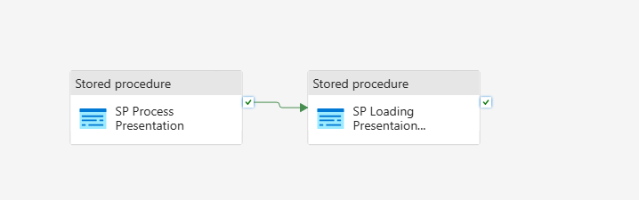
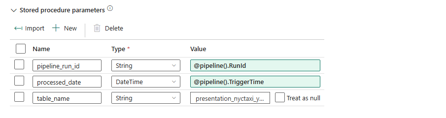
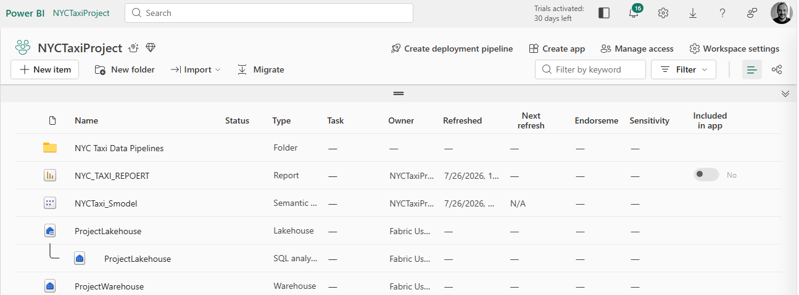
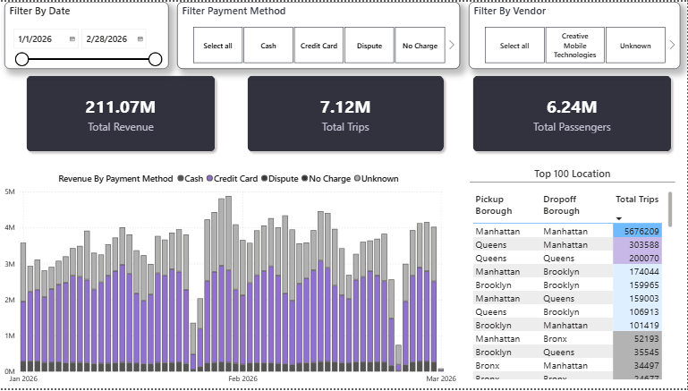

# 🚕 NYC Taxi End-to-End Data Engineering & Analytics Pipeline

An end-to-end data pipeline built on **Microsoft Fabric** that automates the ingestion, staging, transformation, and reporting of New York City Yellow Taxi trip records.

---

### NYC Taxi Solution Architecture


## 📌 Project Overview & Problem Statement

### **The Business Challenge**
The NYC Taxi and Limousine Commission (TLC) generates massive monthly volumes of trip record data containing details on pick-ups, drop-offs, fare amounts, and passenger counts. For analytics teams, ingesting and processing large datasets efficiently on a recurring monthly basis presents key challenges:
* Handling incoming monthly files without duplicating data or re-processing historical runs.
* Ensuring corrupt, out-of-range, or outlier date records are filtered out before business reporting.
* Maintaining a lightweight staging environment while preserving a full historical data archive in presentation models.
* Optimizing computational efficiency across ETL toolsets (evaluating Dataflow Gen2 vs. T-SQL Stored Procedures).

### **The Solution**
This project builds an automated, robust Lakehouse-to-Warehouse data pipeline leveraging **Microsoft Fabric**. It establishes a dynamic ingestion engine that ingests monthly Parquet files, cleanses and enriches trip records with geographic lookup data, logs pipeline watermarks to prevent duplicate loads, and serves formatted datasets directly to Power BI reports via Semantic Data Models.

---
## 🏗️ Organizing the Workspace


---

## 🛠️ Key Technical Features

1. **Storage Layer (Fabric Lakehouse):** Acts as the landing zone for raw monthly TLC trip data stored in Parquet format.
2. **Dynamic Data Factory Pipelines:** Uses parameters and variables to dynamically compute file names, dynamic watermarks, and variable execution dates (`pl_stg_processing_nyc_taxi`).
3. **Automated Staging Management:** Automatically clears/deletes staging tables prior to ingestion while appending historical data safely to presentation tables.
4. **Data Transformation & Cleansing:** Blends lookup data and cleanses outliers using **Dataflow Gen2**, with a high-performance **Stored Procedure** alternative.
5. **Incremental Metadata Logging:** Uses a custom `metadata.processing_log` table tracking row counts, pipeline execution dates, and date watermarks.
6. **Reporting & Analytics:** Exposes the presentation warehouse model via a **Power BI Semantic Model**.

---

## 📊 Data Source

The dataset used in this project originates from the **NYC Taxi & Limousine Commission (TLC) Trip Record Data**. 

* 🔗 **Dataset Access:** You can access the official raw trip data for 2026 directly from the [NYC TLC Trip Record Data Webpage](https://www.nyc.gov/site/tlc/about/tlc-trip-record-data.page).
* **Format:** Monthly Parquet Files.
* **Scope:** NYC Yellow Taxi (Medallion) Trip Records and Taxi Zone Location Lookup Files.

---
## Overall Pipeline


## 🛢️ Core Pipeline Logic & SQL Scripts
### Script Activity: `Latest Processed Data`

Use the following query inside the **Script Activity** to retrieve the most recent pickup timestamp processed for the staging table:

```sql
SELECT TOP 1 
    latest_processed_pickup 
FROM metadata.processing_log 
WHERE table_processed = 'staging_nyctaxi_yellow'
ORDER BY latest_processed_pickup DESC;
```
### v_date

Pipeline expression for **v_date** Set Variable activity

```json
@formatDateTime(addToTime(activity('Latest Processed Date').output.resultSets[0].rows[0].latest_processed_pickup, 1, 'Month'), 'yyyy-MM')
```
---
### Copy to Staging
**Pre Copy Script**

---
### v_end_date

Pipeline expression for **v_end_date** Set Variable activity

```json
@addToTime(concat(variables('v_date'), '-01'), 1, 'Month')
```
---
### SP Removing Outlier Dates

For the Stored Procedure Activity “SP Removing Outlier Dates”.
Create the Stored Procedure `stg.data_cleaning_stg` in the Data Warehouse using the code below.

```sql
CREATE PROCEDURE stg.data_cleaning_stg
    @end_date DATETIME2,
    @start_date DATETIME2
AS
BEGIN
    DELETE FROM stg.nyctaxi_yellow 
    WHERE tpep_pickup_datetime < @start_date 
       OR tpep_pickup_datetime > @end_date;
END;
```

---
### SP Loading Staging Metadata

For the Stored Procedure Activity “SP Loading Staging Metadata”.
Code to create the `metadata.processing_log` table.

```sql
CREATE SCHEMA metadata;
GO

CREATE TABLE metadata.processing_log
(
    pipeline_run_id VARCHAR(255), 
    table_processed VARCHAR(255), 
    rows_processed INT, 
    latest_processed_pickup DATETIME2(6),
    processed_datetime DATETIME2(6)
);
GO
```
---
### SP Loading Staging Metadata - Insert Procedure

Create the Stored Procedure `metadata.insert_staging_metadata` in the Data Warehouse using the code below.

```sql
CREATE PROCEDURE metadata.insert_staging_metadata
    @pipeline_run_id VARCHAR(255),
    @table_name VARCHAR(255),
    @processed_date DATETIME2
AS
BEGIN
    INSERT INTO metadata.processing_log (
        pipeline_run_id, 
        table_processed, 
        rows_processed, 
        latest_processed_pickup, 
        processed_datetime
    )
    SELECT
        @pipeline_run_id AS pipeline_id,
        @table_name AS table_processed,
        COUNT(*) AS rows_processed,
        MAX(tpep_pickup_datetime) AS latest_processed_pickup,
        @processed_date AS processed_datetime
    FROM stg.nyctaxi_yellow;
END;
```

---
### Overall Pipeline
This is a view of the pipeline using the Stored Procedure rather than the Dataflow Gen2.This Consumes fewer Fabric Capacity Units (CUs) because T-SQL queries are heavily optimized by the warehouse query engine.

---
### Create the dbo.nyctaxi_yellow table

This is the initial empty table so we can load the data from the Dataflow/Stored Procedure activities.

```sql
CREATE TABLE dbo.nyctaxi_yellow
(
    vendor VARCHAR(50),
    tpep_pickup_datetime DATE,
    tpep_dropoff_datetime DATE,
    pu_borough VARCHAR(100),
    pu_zone VARCHAR(100),
    do_borough VARCHAR(100),
    do_zone VARCHAR(100),
    payment_method VARCHAR(50),
    passenger_count INT,
    trip_distance FLOAT,
    total_amount FLOAT
);
```
---
### SP Processing Presentation

For the Stored Procedure Activity “SP Processing Presentation”.
Create the Stored Procedure `dbo.process_presentation` in the Data Warehouse using the code below.

```sql
CREATE PROCEDURE dbo.process_presentation
AS
BEGIN
    INSERT INTO dbo.nyctaxi_yellow
    SELECT
        CASE 
            WHEN nty.VendorID = 1 THEN 'Creative Mobile Technologies'
            WHEN nty.VendorID = 2 THEN 'VeriFone'
            ELSE 'Unknown'
        END AS vendor,
        FORMAT(nty.tpep_pickup_datetime, 'yyyy-MM-dd') AS tpep_pickup_datetime,
        FORMAT(nty.tpep_dropoff_datetime, 'yyyy-MM-dd') AS tpep_dropoff_datetime,
        lu1.Borough AS pu_borough,
        lu1.Zone AS pu_zone,
        lu2.Borough AS do_borough,
        lu2.Zone AS do_zone,
        CASE 
            WHEN nty.payment_type = 1 THEN 'Credit Card'
            WHEN nty.payment_type = 2 THEN 'Cash'
            WHEN nty.payment_type = 3 THEN 'No Charge'
            WHEN nty.payment_type = 4 THEN 'Dispute'
            WHEN nty.payment_type = 5 THEN 'Unknown'
            WHEN nty.payment_type = 6 THEN 'Voided Trip'
            ELSE 'Unknown'
        END AS payment_method,
        nty.passenger_count AS passenger_count,
        nty.trip_distance AS trip_distance,
        nty.total_amount AS total_amount
    FROM stg.nyc_taxi_yellow nty
    LEFT JOIN stg.taxi_zone_lookup lu1
        ON nty.PULocationID = lu1.LocationID
    LEFT JOIN stg.taxi_zone_lookup lu2
        ON nty.DOLocationID = lu2.LocationID;
END;
```
---
### SP Loading Presentation Metadata

For the Stored Procedure Activity “SP Loading Presentation Metadata”.
Create the Stored Procedure `metadata.insert_presentation_metadata` in the Data Warehouse using the code below.

```sql
CREATE PROCEDURE metadata.insert_presentation_metadata
    @pipeline_run_id VARCHAR(255),
    @table_name VARCHAR(255),
    @processed_date DATETIME2
AS
BEGIN
    INSERT INTO metadata.processing_log (
        pipeline_run_id, 
        table_processed, 
        rows_processed, 
        latest_processed_pickup, 
        processed_datetime
    )
    SELECT
        @pipeline_run_id AS pipeline_id,
        @table_name AS table_processed,
        COUNT(*) AS rows_processed,
        MAX(tpep_pickup_datetime) AS latest_processed_pickup,
        @processed_date AS processed_datetime
    FROM dbo.nyctaxi_yellow;
END;
```

---
### Build the Semantic Model and Create the BI Report

---
### Power BI Report Preview

*Figure: Executive reporting layout connected via Semantic Model.*

